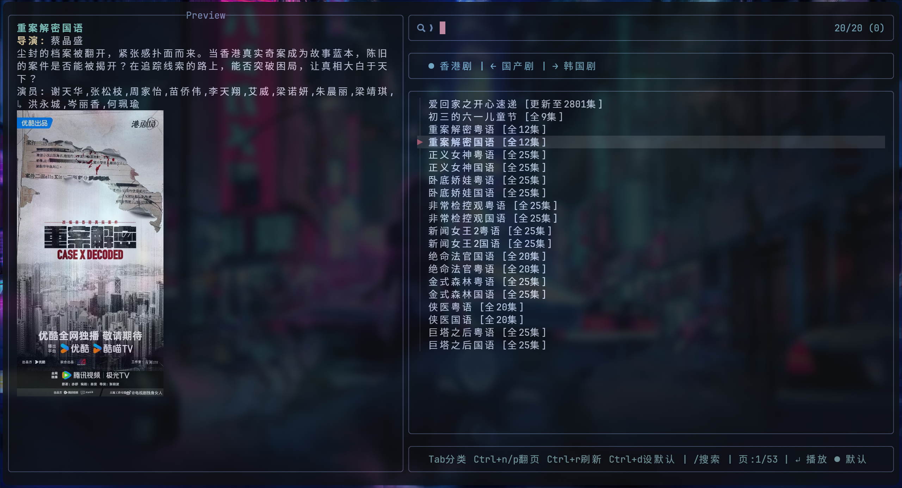

## 预览



```sh
vod -h

Usage: vod [OPTIONS] --url <URL>

Options:
  -u, --url <URL>        Apple CMS API URL [env: VOD_API_URL="xxx"]
  -a, --action <ACTION>  action [class,detail,videolist] [default: ]
  -t, --t <T>            type ID
  -p, --pg <PG>          page number [default: 1]
  -w, --wd <WD>          search keyword
  -i, --ids <IDS>        IDs for detail action [1,2]
  -j, --json             Output in JSON format , default is false
  -h, --help             Print help
  -V, --version          Print version
```

```sh
cargo install --git https://github.com/akirco/vod.git
curl -o ~/.local/bin/vodx -fsSL https://raw.githubusercontent.com/akirco/vod/refs/heads/master/vodx

chmod +x ~/.local/bin/vodx

#设置环境变量 VOD_API_URL=https://360zyzz.com/api.php/provide/vod
```

## vodx 使用 (vodx_old)

```
vodx
Usage: vodx [options] <search_keyword>
Example: vodx 绝命毒师

Options:
  -f, --force      Force search, ignore cache
  -c, --clear      Clear cache before search
  -h, --help       Show this help message
```

## 注意

- 可多选播放单选播放
- F8查看播放列表
- <>键切换上下集
